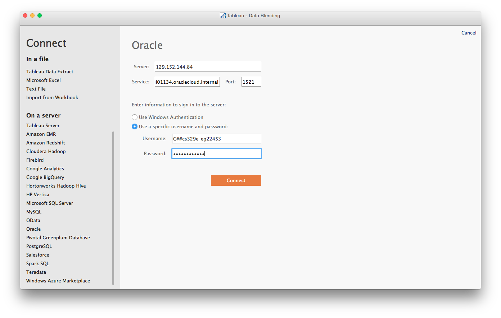
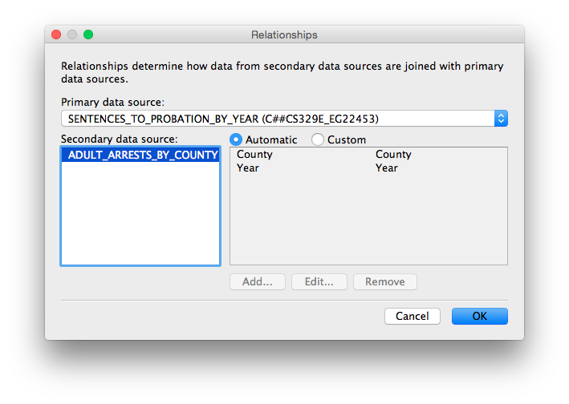
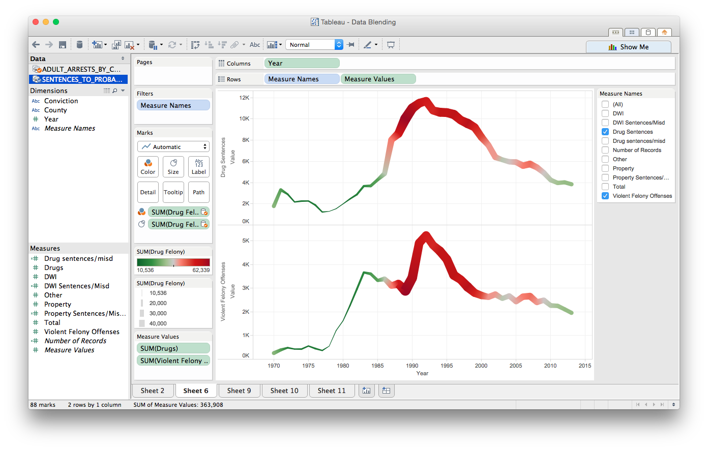
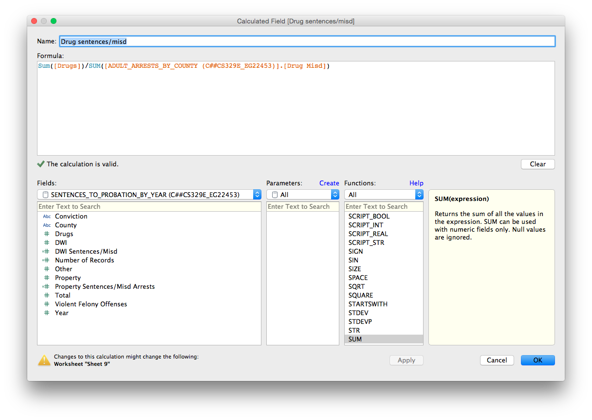
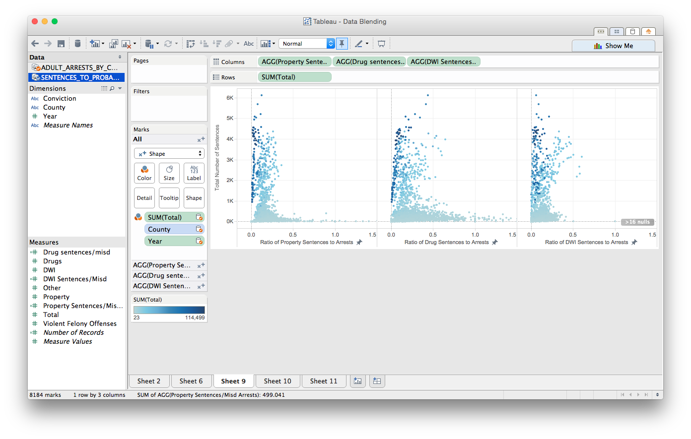
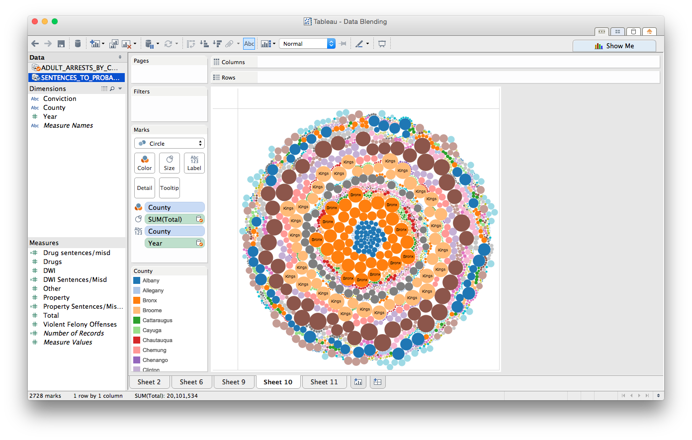
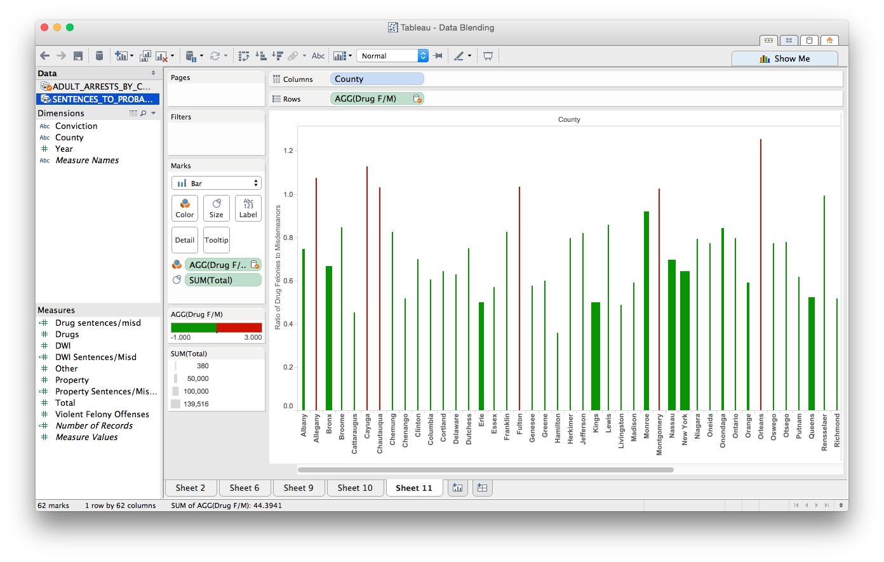

CS 329E Data Visualization - DV_TableauProject3
===
**For this project, we use two different csv files containing New York Crime Data of various types of crimes and their occurences ordered by individual counties. We use Tableau to 'blend' the two tables and produce meaningful plots using data from both sources.**

**Authors: Bruno De Hoyos (bd8739), Estevan Garza (eg22453)**

##Importing data to Tableau

We begin by importing the data to Tableau. Since both of our data tables were previously stored in an Oracle database during an earlier project, we use Tableau's "Connect to Data" wizard by selecting Oracle in the sidebar. Our data can be accessed by using the following credentials:

```
Server: 129.152.144.84
Service: ORCL.usuniversi01134.oraclecloud.internal
Port: 1521
Username: C##cs329e_eg22453
Password: orcl_eg22453
```



We do this process two separate times under the same workbook, in order to import the two tables separately and avoid "joining" them.

##Adding Relationships

Once our data is loaded into Tableau, we must add relationships to the data tables to ensure Tableau is able to use them properly. To do this, we go to `Data >> Edit Relationships...` and add the appropriate relationship that links the data together. For our project, our data was joined by the `County` and `Year` columns, as shown below.

 

##Data Blending

####Blend 1

We are now ready to create some interesting visualizations. For our first image, we wanted to see how drug and violence-relatated sentences correlated with drug felonies. We did this using a simple line graph, plotting `year` on the x-axis and the two measures of interest (`Drug Sentences`, `Violent Felony Sentences`) on the y-axis. In order to make use of the second data table, we adjusted the size and color of the graphs according to the number of drug arrests. It is clear from the graph colors and the upper graph, that with an increase in drug arrests and sentences, there was a definite spike in the number of violent sentences.



####Blend 2

For our second graph, we wanted to see how the ratio of sentences to arrests varied for different types of crimes. In order to do this, we created several calculated fields for drug, DWI, and property crimes. These calculated fields were simply a ratio of the sum of the sentences to the sum of the arrests for each specific crime type, as shown below for the case of drugs. 



With these three calculated ratios (drugs, DWI, and property), we then created plots with these the ratios (x-axis) against the total number of sentences (y-axis) across all crime types, to see if the ratio would change. Surprisingly, we found that the ratio of sentences to arrests was fairly consistent within 0 to 0.5 for these three crime types, regardless if the data point was from a high sentence count (5K), or a low one (50). In order to spice up the data, we colored the points according to the sum of the total number of arrests.



####Blend 3

For our third plot, we decided to visualize crime parameters for all of the different counties in New York. We decided to make a bubble plot, where each county was colored and labeled distinctly. We then sized each bubble according to the total number of arrests in that county for all types of crime. Because each county was given a bubble for each year, coloring by county was useful to see which counties had consistently high (or consistently low) number of arrests across years. It can be seen that some counties, such as Bronx and Kings, were the ones with consistently high number of arrests, whereas some counties are so small that their labels did not even show up.



####Blend 4

For our final plot, we made another calculated field, this time to calculate the ratio of the number of drug felonies to the number of drug misdemeanors, for each county. The calculation was done very similar to the ones under Blend 2, with just a simple division of two sums. We plotted this ratio for all of the different counties using a bar graph, and colored the bars according to their value. If the ratio was over 1, the bars would be red, and anything else would be green. In addition, we adjusted the width of the bars according to the total number of crime sentences for that respective county. Surprisingly, we found that the counties with red bars (that is, more felonies than misdemeanors) were also counties with thin bars (meaning a low number of crime sentences). This seems a little counterintuitive, but there are some exceptions to every case.




