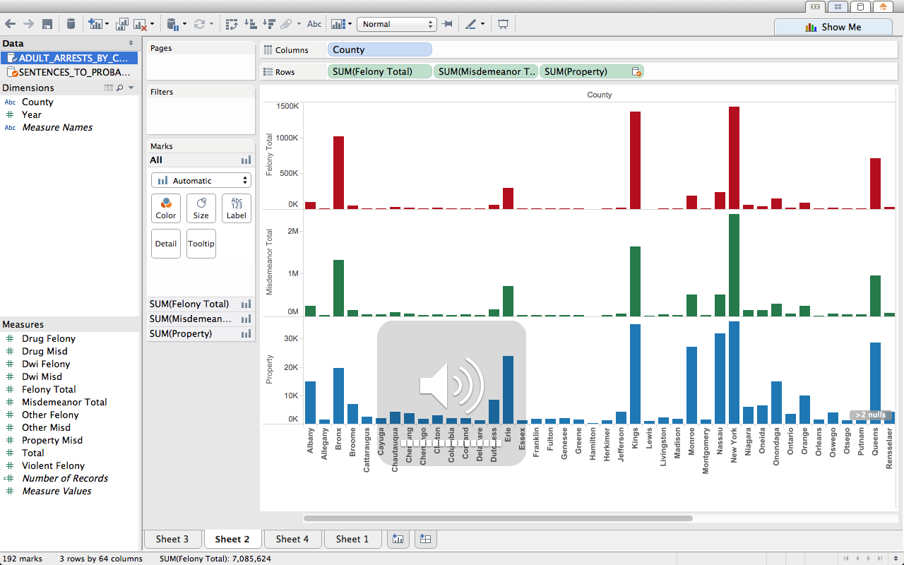
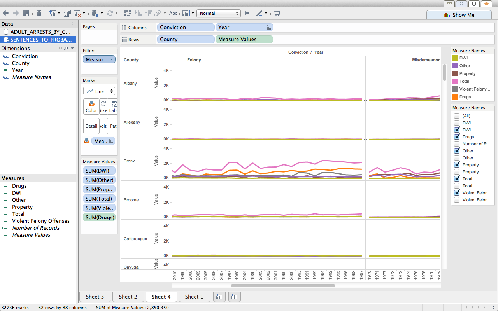
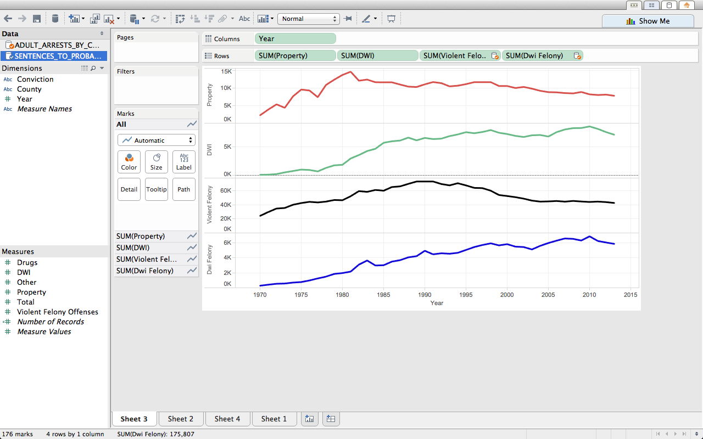
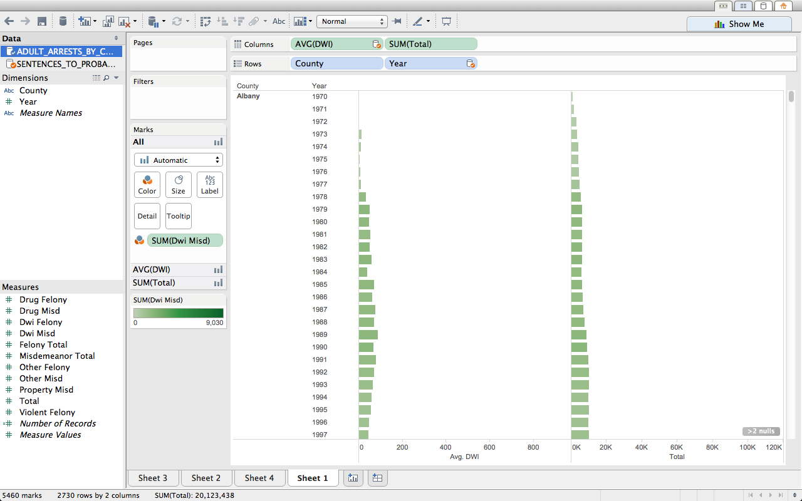

CS 329E Data Visualization - DV_TableauProject3
===
**For this project, we use in-depth government census data that focuses on New York Crime Data that represents various types of crimes and their occurences ordered by individual counties. **

**Authors: Bruno De Hoyos (bd8739), Estevan Garza (eg22453)**

###Importing data frames:

We begin by importing some useful libraries:

```{r, warning=FALSE}
require(bitops)
require(stats)
require(ggplot2)
require(grid)
require(plyr)
require(reshape2)
require(RCurl)
require(gplots)
require(tidyr)
require(dplyr)
require(jsonlite)
```


**Our first visualization utilizes a bar chart in order to compare rates of total felonies, total misdemeanors, and total property crimes grouped by individual counties. County names are along columns while the crimes are all representated by rows. .**
 


**The next visualization uses a multicolored line graph, grouped by county, in order to compare the number of reported crimes by the type of crime itself. We filter the measure names and only include crimes involving drugs, DWI, property, violent crimes, total crime, and other in order to get an accurate representation of the magnitude of these incidences from 1970 to 1997. In addition, we have two column headers that show reported crimes that are either misdemeanors or felonies.**
 


**Our third tableau sheet graphs the occurence of TOTAL specific crimes (violent, DWI, Property) from 1970 to 2013 in order to find correlations between crimes that would seemingly have no relation. In this graph we do not group by county and instead sum the entire amount of crime within that year for the state of New York.**
 


**The last sheet uses a horizontal histogram that compares overall rates of DWI crimes and TOTAL crimes in two different columns. These measurements are grouped by county and also shown from the years 1970 through 2013. In the workbook we can see that DWI crimes are sometimes correlated with total crime and sometimes they are not**   

 
